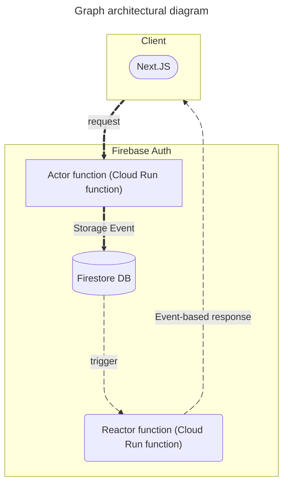
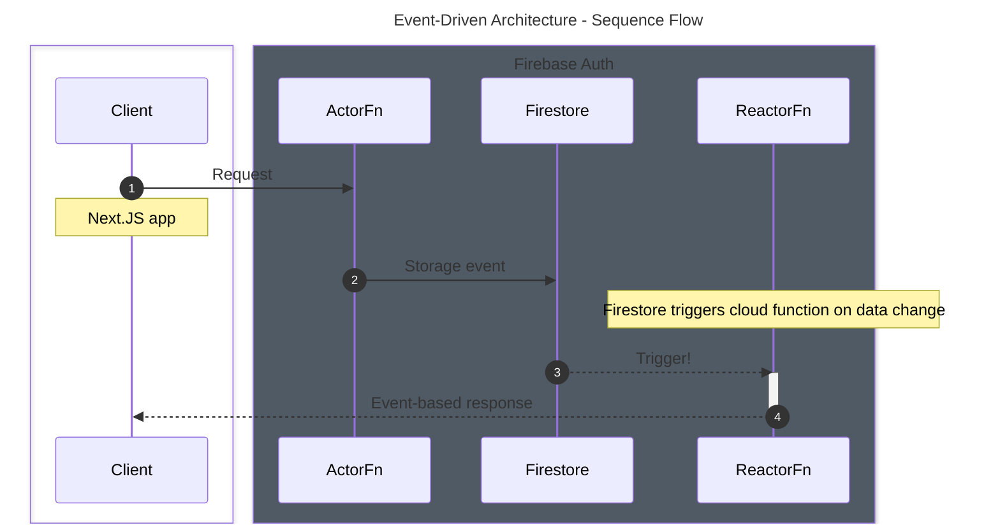

# A. Data Architectural diagrams





# B. Firestore Data structure

### User

The `User` collection holds information about a user and is structured as follows:

```ts
// User: users/{userId}
{
  userId: UUID;
  userName: string;
  avatar: MediaReference.fileHash;
  fullName: string;
  password: string;
  email: string;
  createdAt: datetime;
  updatedAt: datetime;
  lastSeen: datetime;
  groups: Array<Chat.id>;
}
```
#### Indexing considerations
- `userId`
- `email`
- `groups`

### Chat room

The `Chat` room collection holds information about a chat room and is structured as follows:

```ts
// Chat: chats/{chatId}
{
  chatId: string;
  participants: Array<User.id>;
  type: Enum("direct", "group");
  name: string;
  media: MediaReference.fileHash;
  createdAt: datetime;
  lastMessage: Message; //(Snapshot)
  admins: Array<User.id>;
}
```

The `chats/{chatId}` document structure supports the following types of chat rooms:

- **One-to-one chat room:**

  This type of chat room usually involves just two participants.

  > **ID format:** The `chatId` field of one-to-one chat rooms will be composed of the sorted UUID of participants i.e: `{participant1.userId}_{participant2.userId}` where `participant1.userId` < `participant2.userId`. Having a sorted UUID eliminates guessing and allows for consistent and simplified querying of the chat room.  
  >  **For example**, if the UUIDs of two participants are `123e4567-e89b-12d3-a456-426614174000` and `123e4567-e89b-12d3-a456-426614174001`, the resulting chat room ID will be `123e4567-e89b-12d3-a456-426614174000_123e4567-e89b-12d3-a456-426614174001`.

  The `Chat.type` is an additional field used to ascertain whether a chat room is a group or one-to-one chat. Where `direct` indicates a one-to-one chat room and `group` indicates a group.

  For example:

  - A one-to-one chat room between two users with IDs `user1` and `user2` will have `Chat.type` set to `direct`.
  - A group chat room named "Project Team" with multiple participants will have `Chat.type` set to `group`.

- **Group chat room:**

  This type of chat room usually involves more than two participants.

  > **ID format:** The `chatId` field for groups will be prefixed by the keyword: `group` and followed by the unique UUID. i.e `{group}_{unique UUID}` (e.g., `group_e89b-12d3-a456-426614174000`).
  > Although not required, using the suggested ID format can help in easily identifying groups at a glance.

  To list the groups a `User` belongs to, retrieve the `User.groups` array from the user's document. Using this array, you can then query the necessary group information.
  This implies that there is a one-to-many relationship between `User`and `Chat` collection and this relationship is documented in the `User.groups` field.

  The `Chat.participants` and `Chat.admins` fields are arrays of `User.userId`. These fields ensure that only certain participants can perform specific privileges within a group chat room. This allows for listing groups to external participants while maintaining participation restrictions.

  > Bonus: The `User.groups` array can also be used to manage a user's access to specific chat groups.

#### Indexing considerations
- `chatId`
- `media`

### Messages

This is a sub-collection of the `chats/{chatId}` document, and it is structured to contain information about the chat message.

```ts
// Message: chats/{chatId}/messages/{messageId}
{
  messageId: UUID;
  text: string;
  senderId: User;
  createdAt: datetime;
  type: Enum("text", "image", "audio");
  readBy: Array<User.id>;
  media: {
    images: Array<MediaReference.fileHash>;
    vfileHasheos: Array<MediaReference.fileHash>;
    audios: Array<MediaReference.fileHash>;
    docs: Array<MediaReference.fileHash>;
  }
}
```
The above structure supports adding message types that include just text or media or both. File media are uploaded and stored as content-addressable hashes, which are unique identifiers generated based on the content of the file itself. For example, a file with the same content will always produce the same hash, such as `abc123` for a specific image, ensuring efficient deduplication and retrieval.
The `Message.media` is a document that contains references to stored file hashes. This approach scales well for group chats and for shared content across several chats. 

#### Indexing considerations
- `messageId`
- `createdAt`: Indexed to efficiently retrieve messages in chronological order, which is common in chat applications.

Compound Index: A compound index on `chatId` and `createdAt` can be useful for fetching messages in a specific chat sorted by time.
```ts
// MediaReference: mediaReference/{fileHash}
{
  fileHash: string;
  storagePath: string;
  createdAt: datetime;
  mimeType: string;
  sizeKB: number;
  usedBy: {
    chat: Array<{ chatId: Chat.chatId; messageId: Chat.messageId }>;
    user: Array<{ userId: User.userId }>;
  }
}
```
To ensure proper tracking of reference usage, each media reference includes metadata, documenting where and how it is used. For example, the `MediaReference` document can track usage in specific user profiles, chats and messages through fields like `usedBy.user.userId`, `usedBy.chat.chatId` and `usedBy.chat.messageId`, as shown in the `MediaReference` structure above.
The `MediaReference` document simplifies and standardizes cleanup processes. The `MediaReference.storagePath` references the exact location where the media is being stored. For example: `uploads/media/abc123.jpg`

#### Indexing considerations

- `fileHash`: This field ensures efficient deduplication and retrieval of media by its hash.
- `usedBy.chat.chatId` (Sparse indexing).
- `usedBy.user.userId` (Sparse indexing).

## C. Storage structure (Firebase Storage)

Media will be stored as follows:

```js
// uploads/media
{fileHash}.{ext}
```
